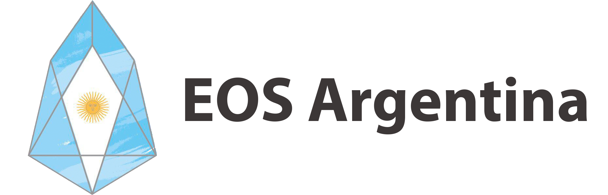

# EOSPedia

## ¿Quiénes mantienen este repositorio?

Este proyecto es una iniciativa del Productor de Bloques EOS Argentina con el objetivo de generar un espacio de contenidos en español para la comunidad.  Esperamos que distintas comunidades  globales de habla hispana se sumen a esta iniciativa para poder generar contenidos confiables y actualizados.

Los contenidos de este repositorio se encuentran bajo licencia de código abierto y puede ser usados y distribuidos libremente.



## ¿Cómo puedo contribuir?

Toda la documentación creada en esta página puede ser encontrada en el repositorio de **github** indicado abajo, las colaboraciones pueden ser realizadas a través de **github** y EOS Argentina junto con otros colaboradores que lo deseen trabajarán en su revisión antes de ser incluidos en el sitio.



```text
https://github.com/eosargentina-docs/es
```




